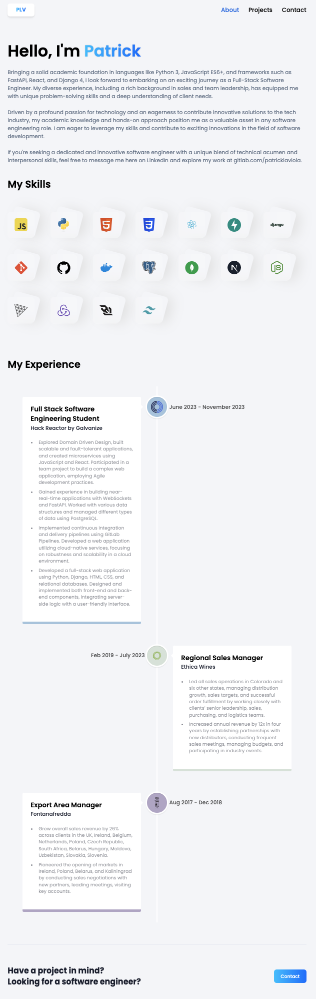
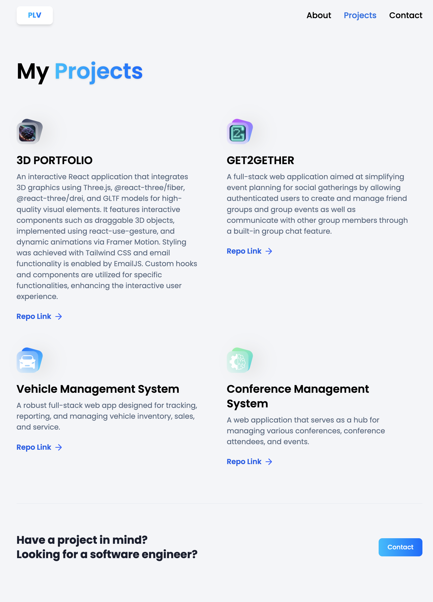
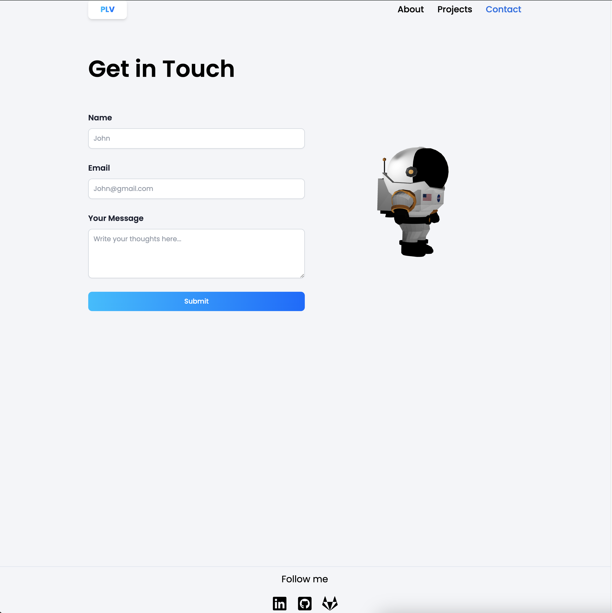

# 3D Portfolio Website

Welcome to the official repository of [Patrick La Viola's 3D Portfolio Website](https://www.patricklaviola.com/). This website is a modern, interactive showcase of my professional and creative work in 3D design and development. It's built using a combination of advanced web technologies including Vite, React, React Three Fiber, Tailwind CSS, EmailJS, and Three.js.

## Overview

This portfolio is more than just a display of work; it's a testament to the power of combining creativity with cutting-edge web technologies. Each element of the site has been carefully crafted to provide an engaging user experience, showcasing my skills and projects in a unique, interactive 3D environment.

## Features

- **Interactive 3D Experiences:** Leveraging React Three Fiber and Three.js, the website offers immersive 3D experiences that make portfolio browsing more engaging. Visitors can interact with some 3D models right on the homepage, providing a dynamic and interactive showcase of my work.
- **Intuitive Navigation:** The site features a straightforward, user-friendly navigation system, allowing visitors to easily transition between the "About", "Projects", and "Contact" pages, ensuring a seamless and informative browsing experience.
- **Responsive Design:** Tailored for all devices using Tailwind CSS, ensuring a seamless experience on desktops, tablets, and smartphones.
- **Contact Integration:** Integrated with EmailJS, allowing for direct, hassle-free contact through the website.
- **Modern Development Stack:** Utilizing Vite and React for fast, efficient, and maintainable codebase.
- **Hosted on Hostinger:** Reliable and fast hosting, providing a smooth user experience globally.

## Screenshots

Here are some screenshots of the website:

### Homepage


### About Page



### Projects Page



### Contact Page



## Installation and Setup

Before you begin, ensure you have [Node.js](https://nodejs.org/) installed on your machine. Then, clone the repository:

```bash
git clone https://gitlab.com/patrick.laviola/3d-portfolio.git
cd 3d-portfolio
```

Install the dependencies:

```bash
npm install
```

To start the development server:

```bash
npm run dev
```

## Acknowledgements

- React Three Fiber for enabling 3D rendering in React
- Three.js for the foundational 3D JavaScript library
- Tailwind CSS for the utility-first CSS framework
- EmailJS for simplifying email integration
- Hostinger for reliable web hosting services

---
